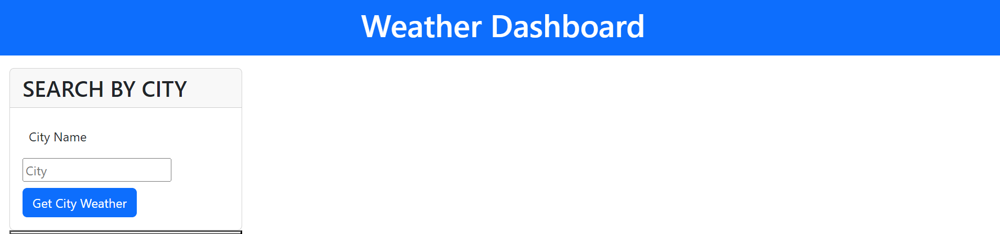
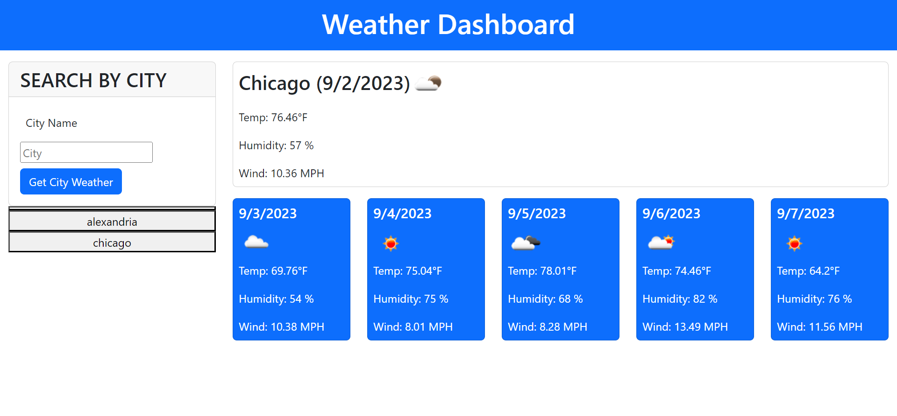

# challenge_5-Weather_Dashboard

## Description 
This is a simple weather application that allows a user to check weather for current day and five more days ahead. This app will run in the browser and feature dynamically updated HTML and CSS framework (bootstarp) powered by jQuery and api.

 ## Table of contents.
     1. card that allows user to input city name.
     2. card to display current weather data.
     3. container to display five days forecasted weather each in a card to display each day weather data.

 ### page:
 when the user runs the page it will show an input text field to let user pass a city name.
 current day weather will be displayed colleted from open weather api.
 five days forecasted weather data will be displayed colleted from open weather api.
 search history will allow user to save previous searches if wanted to access again. 
 

 ## Usage.
  once the user runs the app it will show an input text area to pass city name,
  this city will then be saved to local storage and can be accessable again from search history,
  the top part will represent the current day weather data,
  the bottom part will represent five days forecasted weather each in a card .
 ## Screenshots.

### Deployed Page Link:

https://nabil1294.github.io/Weather_Dashboard/

## Credits.

setting local storage
https://stackoverflow.com/questions/40791207/setting-and-getting-localstorage-with-jquery

day.js
https://day.js.org/docs/en/display/format

local storage getting value
https://www.w3schools.com/jsref/met_storage_getitem.asp

template literals
https://developer.mozilla.org/en-US/docs/Web/JavaScript/Reference/Template_literals